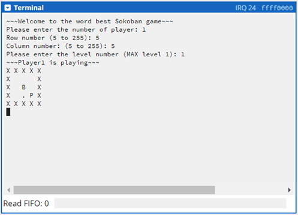
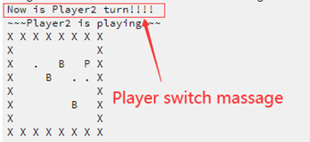

# **Sokoban Game User Guide**

---

## **Introduction**
Welcome to the Sokoban Puzzle Game! In this game, you are tasked with pushing all boxes onto designated target locations within a grid. Sounds simple? Think again! The game requires strategy and planning to make sure that the boxes do not get stuck, as there is no way to pull them back once pushed.

This guide will help you understand how to set up, play, and restart the game, as well as how to manage multiplayer mode and more advanced game features.

---

## Requirements
+ **Platform:** The game requires the CPUlator RISC-V RV32 SPIM version to run the code. 
  + You can open it using the following link:
    + https://cpulator.01xz.net/?sys=rv32-spim

+ **Players:** Supports **1 or more players**. 

---

## Fast Link

- [Game Setup](#game-setup)
  - [Pre-game Setup](#pre-game-setup)
    - [Step 1: Open CPUlator RISC-V RV32 SPIM Version](#step-1-open-cpulator-risc-v-rv32-spim-version)
    - [Step 2: Load the Game Source Code](#step-2-load-the-game-source-code)
    - [Step 3: Launch the Game](#step-3-launch-the-game)
  - [In-game Setup](#in-game-setup)
    - [Input Guidelines](#input-guidelines)
    - [1. Number of Players](#1-number-of-players)
    - [2. Row and Column Numbers](#2-row-and-column-numbers)
    - [3. Level Number](#3-level-number)
    - [4. End of In-game Setup](#4-end-of-in-game-setup)
- [Game Controls](#game-controls)
  - [1. Movement Keys](#1-movement-keys)
  - [2. Additional Commands](#2-additional-commands)
- [Game play](#game-play)
  - [Symbol Reference](#symbol-reference)
  - [Objective](#objective)
  - [Box and Target Interaction](#box-and-target-interaction)
  - [Rules](#rules)
  - [Multiplayer Mode](#multiplayer-mode)
  - [Reset, Restart, and End](#reset-restart-and-end)
  - [Game End](#game-end)
- [Troubleshooting](#troubleshooting)

## Game Setup

### Pre-game Setup

#### Step 1: Open CPUlator RISC-V RV32 SPIM Version
To begin, you need to open the CPUlator simulator. You can do this in one of the following ways:
- Click the link provided in the requirements section.
- Alternatively, copy and paste the link into your web browser. (See Figure 1)

  
  
  
<b>Figure 1:</b> Shows where to paste the link in the browser

#### Step 2: Load the Game Source Code
Once you've opened CPUlator, follow these steps to load the game's source code:

1. In the top navigation bar, click on the **File** button (located next to the "Reload" button. See Figure 2 for visual description).
   
   

   
<b>Figure 2:</b> Demonstrate the location or open the file option

2. From the dropdown menu, select **Open...**. This will bring up a file selection window.

3. In the file selection window, locate and choose the `sokoban.s` file (the game source code), then click **Open** to load it into the simulator as shown in Figure 3.

  

    
  

   
<b>Figure 3:</b> Load the sokoban.s into CPUlator

<!-- 

 -->

#### Step 3: Launch the Game
Congratulations! You've successfully loaded the source code. Now, just a couple more steps before you can start playing:

1. Click the **Compile and Load (F5)** button and wait for the `Compile succeeded` message to appear in the **Messages** section at the bottom of the window. (See Figure 4 for visual description) 
   
   

   
<b>Figure 4:</b> How to compile the code

2. Once the compilation is complete, click the **Continue** button to run the game. (See Figure 5 for visual description) 
   
   

   
<b>Figure 5:</b> How to run the game

3. Once you see the welcome message displayed in the **Terminal** section (Locate at right of the window), the Pre-game Setup is finish. **Congratulations!**
   
  

    
  

   
<b>Figure 6:</b> The welcome massage when successfully run the game

### In-game Setup

#### Input Guidelines
Before you start configure the in-game parameter, you must be aware the input restriction for this section

+ All inputs during the setup phase must be **positive integers**. If you input any **non-integers** value, you will need to refresh the page and restart the setup from the beginning. (See Figure 7 for visual demonstration)

  

    
  

  
<b>Figure 7:</b> Allowed input vs. Forbidden input

#### 1. Number of Players

First the game will ask you to input the number of players.

+ For single-player, type **1** and press Enter.
+ For multiplayer, input the number of players (max value: \(2^{31}-1\)). 
  + ==**Please do not enter any value over \(2^{31}-1\) you will break the game!!!**==
+ The minimum allowed number of players is **1**. Any value less then this the game will prompt you to re-enter a valid number.

  

    
  

  
<b>Figure 8:</b> Massage displayed when input a player number below minimum requirement

#### 2. Row and Column Numbers
Next, you'll set the dimensions of the board.  

+ **Row number (5 to 255):** The minimum number of rows is **5**. If you enter a value smaller than 5, you'll be asked to re-enter.
  
  

    
  

  
<b>Figure 9:</b> Massage displayed when input a row number below minimum requirement

+ **Column number (5 to 255):** Similarly, the minimum number of columns is **5**. If the input is invalid, you'll be asked to re-enter.
  
  

    
  

  
<b>Figure 10:</b> Massage displayed when input a column number below minimum requirement

**Tip:** It's highly recommended to keep the board size within **50x50**, as larger boards may look awkward and negatively impact the user experience.

#### 3. **Level Number**
After setting the board size, you'll choose a level number. Remember, as the **level increases**, the chance of getting **more boxes** also **increases**, making the game more **challenging** to solve.

+ The minimum level is **1**, and the maximum level will be displayed in the prompt.
+ If you enter a value smaller than **1**, you will be asked to re-enter a valid number.

  

    
  

  
<b>Figure 11:</b> Massage displayed when input a level number below minimum requirement

+ **Important:** If you enter a level number higher than the displayed maximum, the game will generate the same result as the maximum level.

#### 4. End of In-game Setup
Once you've completed the previous steps successfully, the game board should now be visible in your terminal (If not see **Troubleshooting** section). If it is, you're all set and ready to jump into the game! Enjoy!

  

    
  

  
<b>Figure 12:</b> An example of what you would see in a correctly configured setup.

*Remember again the difficulty will depend on the size of the board and level you selected, so strategize wisely!*

## Game Controls

**Note**: All inputs must be in **lowercase letters**.

### 1. Movement Keys:
+ **w**: Move Up
+ **s**: Move Down
+ **a**: Move Left
+ **d**: Move Right

### 2. Additional Commands:
+ **e**: Exit the game
+ **r**: Reset the board to its original state
+ **p**: Restart the game from the very beginning

---

## Game play

### Symbol Reference

| Symbol      | Meaning       |
| ----------- | ------------- |
| `P`         | Character     |
| `B`         | Box           |
| `b`         | Box on target |
| `.`         | Target spot   |
| `X`         | Wall          |
| ` ` (space) | Walkable path |

### Objective
The goal of Sokoban is to push all the boxes (represented by `B`) onto the target spots (represented by `.`). You control the character (represented by `P`) and navigate through the gameboard, pushing the boxes one at a time onto the targets.

### Box and Target Interaction
+ When a box (`B`) is successfully pushed onto a target spot (`.`), it will change to a lowercase `b` to indicate that the box is in place on the target. (See Figure 13 for visual description)

  

    
  

  
<b>Figure 13:</b> Box on target vs. Box on not target

+ All boxes need to be placed on target spots to finish the game.

  

    
  

  
<b>Figure 14:</b> Massage for round finish

<!-- 

 -->

### Rules
+ **Pushing Boxes**: You can only push the boxes, not pull them. Be careful not to push a box into a corner, as you won't be able to move it again.
+ **Invalid Moves**: If you try to move into a wall (`X`) or attempt to push multiple boxes at once, your character (`P`) won't move, but your step count will still increase. Precision is key!
+ **Unexpected Behavior**: If you experience any unexpected game behavior, refer to the **Troubleshooting** section for help.

### Multiplayer Mode
In multiplayer mode, players take turns after each completes the game. When it's a player's turn, a message will appear, such as **"Now it's PlayerX turn!"**.

  

    
  

  
<b>Figure 15:</b> Massage for Player switch

### Reset, Restart, and End
+ If you make a mistake and stuck a box, you can:
  + Press **r** to reset the board to its original state and try again.
    + **Note**: This will note reset you step/move count.
  + Press **p** to restart the game from scratch, generating a new board.
  + Press **e** to end the game.

### Game End
Once all boxes (`B`) are placed on the target spots (`.`), you will receive a congratulatory message, and the game will display your total number of moves.
  + In **multiplayer mode**, the player with the fewest moves will be placed at the top of the leaderboard, while the player with the most moves will be listed at the bottom.
    
    

      
    

    
<b>Figure 16:</b> Leaderboard example shown at the end of the game

  
  + **Ties** are broken by who played first.

**Note**: After the game ends, you must repeat the entire setup process as described in the [Game Setup](#game-setup) section.

## Troubleshooting

1. **Invalid Input**
   + If you enter a value below the minimum requirement for grid size, player number, or level number, the game will ask you to try again with a valid input.
   + If you enter an invalid or unspecified character during the game play, the game will display a message asking you to re-enter the correct command.

2. **Stuck Box**
   + If you push a box into a corner or any unmovable space, the game cannot be completed. To fix this, restart the board by pressing the **r** key.

3. **Unexpected Game Behavior**
   + If the game does not run as expected, I apologize for the inconvenience. This issue is most likely caused by an invalid input either during the setup phase or mid-game. To resolve it, refresh the page and restart the setup process from the beginning.
